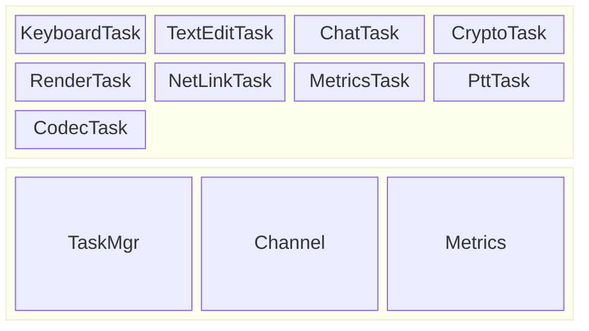
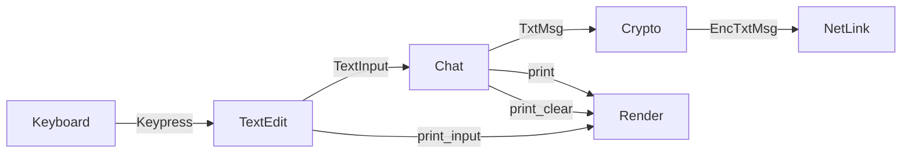
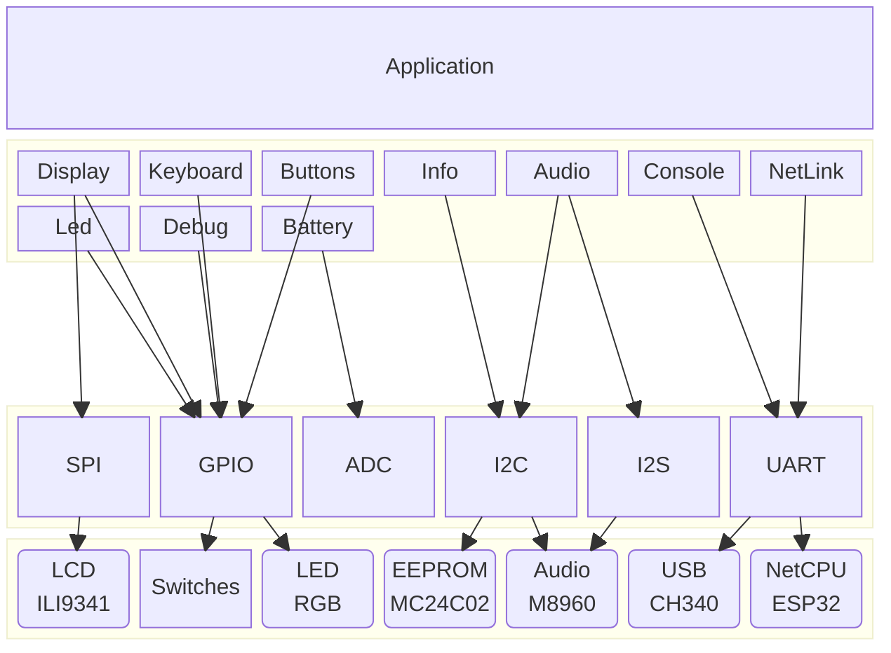

# Architecture

The design follows a dataflow architecture where multiple tasks
communicate by sending messages to each other. This system is built on
top of BSP (Board Support Package) that interface with the HAL 
(Hardware
Abstraction Layer), which in turn interacts with the hardware.

* Tasks:
  Tasks are individual units of work that are executed periodically.
  Each task has specific information such execution interval, time
  budget, and memory budget.

* Channel:
  Channels are used for inter-task communication. They allow tasks to
  send and receive messages asynchronously.

* Metrics:
  Metrics are used to monitor the performance and resource usage of
  tasks as well as any other metrics in the system as a hole. The
  MetricsTask is responsible for periodically printing these metrics
  to the console and then resetting them.

The following diagram shows the basic architecture of the applications
components.

## Tasks

### Render 

Render keeps track of all the text and graphics that need to be on 
the screen. The screen is divided up into 10 bands. It then 
periodically renders all the text and graphics into a pixel buffer 
that covers just one band. That buffer is then send to the BSP 
Display module to be displayed on the screen.

Render has display status icons near the top of the screen and has 
a main text region that is used for displaying text messages as 
well as the text input region. The text input region is used for 
displaying data from the keyboard task as the user types.

## Data Flows

The following diagrams show the data flow between tasks for various
operation. The labels on the arrows show the message type used in
the channel for communication.

### Outbound Text Message Data Flow

### Inbound Text Message Data Flow

### Outbound Audio Data Flow

### Inbound Audio Data Flow

### Group Selection Data Flow

TODO - describe how the group selection works

### Remote Storage Data Flows

TODO - describe flows for remote storage

# Board Support and Hardware Abstraction Layers

The following diagram shows how the applications uses modules from the
BSP layer which in turn use the HAL layer to interact with the
hardware.

