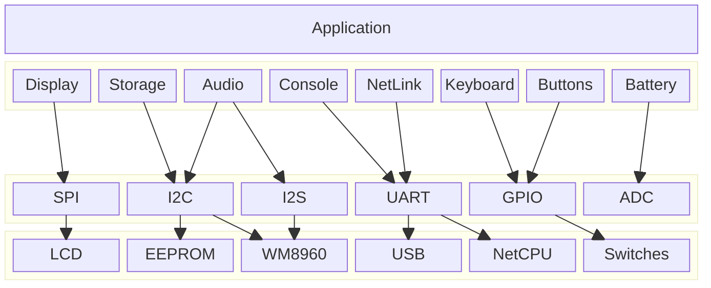

# Arch

The following diagram shows how the applications uses 
modules from the DEV layer which uses the HAL layer
to interact with the hardware.

```mermaid
block-beta
columns 1
  Application
  block:DEV
      Display
      Storage
      Audio
      Console
      NetLink
      Keyboard
      Buttons
      Battery
  end
  space
  block:HAL
    SPI
    I2C
    I2S
    UART
    GPIO
    ADC
  end
  block:Hardware
        LCD
        EEPROM
        WM8960
        USB
        NetCPU
        Switches
  end
  Keyboard --> GPIO
  Display --> SPI
  Audio --> I2S
  Audio --> I2C
  Storage --> I2C
  Battery --> ADC
  Console --> UART
  Buttons --> GPIO
  NetLink --> UART
  SPI --> LCD
  UART --> NetCPU
  I2C --> WM8960
  I2S --> WM8960
  I2C --> EEPROM
  GPIO --> Switches
 UART --> USB
```

