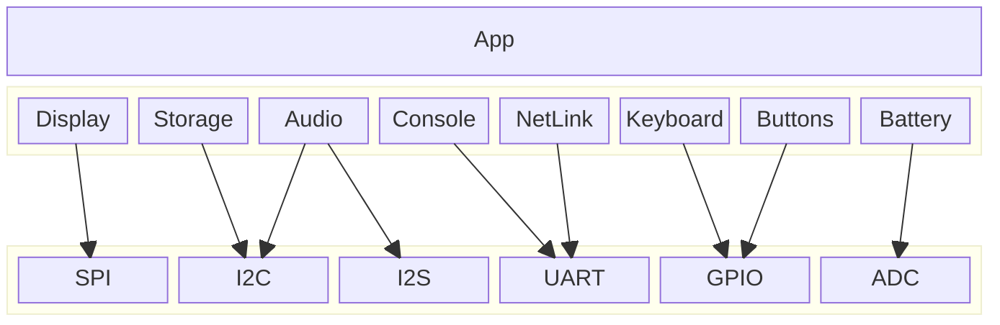
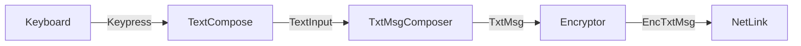

# Arch

```mermaid
block-beta
columns 1
  App
  block:DEV
      Display
      Storage
      Audio
      Console
      NetLink
      Keyboard
      Buttons
      Battery
  end
  space
  block:HAL
    SPI
    I2C
    I2S
    UART
    GPIO
    ADC
  end
  Keyboard --> GPIO
  Display --> SPI
  Audio --> I2S
  Audio --> I2C
  Storage --> I2C
  Battery --> ADC
  Console --> UART
  Buttons --> GPIO
  NetLink --> UART
```

## Outbound Text Message DataFlow

```mermaid
flowchart LR
    A[Keyboard] --> |Keypress| B[TextCompose]
    B --> |TextInput| C[TxtMsgComposer]
    C --> |TxtMsg| D[Encryptor]
    D --> |EncTxtMsg| F[NetLink]
```

## Arch 
